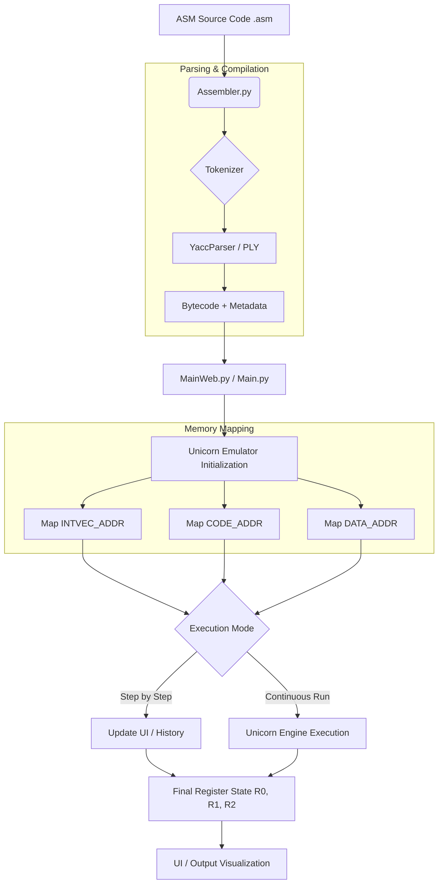

# ARMulator Unicorn
#### University of Rome Tor Vergata <br> BSc in Computer Science <br> A.Y. 2025/2026 - Computer Architecture <br> Prof. A. Simonetta, Eng. E. Iannaccone <br> Serena Stefani, Beatrice Principali, Angelo De Felice

## 1. Introduction 

ARMmulator is a lightweight ARMv7 emulator tool built on top of [Unicorn Engine](https://www.unicorn-engine.org/).It bridges the gap between assembly source code and hardware-level execution by integrating a custom assembler, memory management, and state history tracking.

### 1.1 About the project
Unicorn took QEMU's CPU emulation core and turned it into an embeddable library which can be controlled by API, by removing the bootloader, device emulation, OS, and anything else. It achieves high performance through the Just-In-Time (JIT) compiler technique. This means that ARM Bytecode is not interpreted instruction by instruction (as `simulator.py` from the original project did), but it is compiled at runtime into native code of the host machine.
The old version of ARMulator (based on epater) used a pure python interpreter: every instruction was decoded, analyzed and simulated in Python. This means that performance was slow and limited to ARMv4. With Unicorn the flow becomes :
1. `assembler.py` generates the ARM Bytecode just like before.
2. The new `min_egine_versione_in_mod_classe.py` loads that bytecode into Unicorn, maps the memory, and configures the registers.
3. Unicorn runs the code using native JIT compilation, exposing hooks that intercept each instruction, memory access, and interrupt — used to update the GUI state and manage debugging.

### 1.2 Supported Architectures
Unicorn generally supports ARM, ARM64 (ARMv8), m68k, MIPS, PowerPC, RISC-V, S390x (SystemZ), SPARC, TriCore and x86 (including x86_64). 
In fact the previous project was stuck on ARMv4, but with Unicorn it now supports ARMv7.

### 1.3 Main Changes
- Updated dependencies in the `requirements.txt`.
- Created a new engine `min_egine_versione_in_mod_classe.py` with **Unicorn**.
- Created a new `main.py` as the CLI entry point.
- `simulator.py` acts as an orchestrator, `simulatorOps` handles the `explain()` part, and `min_egine_versione_in_mod_classe.py` however is responsible for fetching (`fetch()`) and  (`decode()`).
- PC (Program Counter) in the old version was manually updated, now Unicorn handles it.
- Now compatible with macOS

### 1.4 ARMulator (Original) VS ARMulator Unicorn

| Aspect | ARMulator (original) | ARMulator-Unicorn |
|---|---|---|
| **Instruction execution** | Pure Python interpreter, one instruction at a time | Unicorn JIT (native C), much faster |
| **Who executes** | `simulator.py` + `simulatorOps/` | `min_egine_versione_in_mod_classe.py` (UnicornEmulator) |
| **Instruction decoding** | `bytecodeToInstr()` manually analyzes bits in Python | Unicorn internally, automatic |
| **PC update** | Manual in Python after each instruction | Unicorn updates it automatically |
| **Role of `simulator.py`** | Engine + orchestrator (did everything) | Orchestrator only (delegates execution) |
| **`simulatorOps`** | Used for decoding + execution + disassembly | Used only for GUI disassembly |
| **Breakpoints** | Managed entirely in Python | Managed via Unicorn hooks (`hook_code`, `hook_mem`) |
| **IRQ/FIQ interrupts** | Managed in Python | Still managed in Python (Unicorn does not support them natively) |
| **CPU state sync** | Not needed (everything in Python) | Required at every step (sync in → execute → sync out) |
| **History/reverse debug** | Recorded directly in Python | Recorded after sync out, comparing byte by byte |
| **ARM compatibility** | ARMv4 only | Potentially ARMv7/ARMv8 (depends on Unicorn) |
| **Portability** | Issues on macOS | Windows, Linux, macOS supported by Unicorn |
| **Speed** | Slow (everything interpreted in Python) | Much faster (native JIT) |


## 2.Architecture Overview

### 2.1 Project structure
``` Plaintext
ARMulator-Unicorn/
│
├── assembler.py                                # ARM Source → Bytecode compiler
│
├── bytecodeinterpreter.py                      # Middleware (UI logic, breakpoints, state)
│
├── components.py                               # Hardware components (Registers, Memory, Flags)
├── generadoc.bat
├── history.py                                  # Execution history for reverse-debugging
├── howitworks.jpg
├── __init__.py                                 
├── interface                                   # Web Frontend (HTML/JS/CSS)
├── LICENSE
├── main.py                                     # CLI Entry point
│
├── mainweb.py                                  # Web Entry Point (Bottle server + WebSockets)
├── manuale.pdf
├── min_egine_versione_in_mod_classe.py         # ← NEW CORE FILE
│                                               # Replaces the legacy simulator with the Unicorn Engine.
│                                               # Inherits UI methods from BCInterpreter.
│                                               # Overrides only step(), execute(), and reset().
│                                              
├── native_app.py                               # Desktop Wrapper (pywebview + Qt)
├── parser.out
├── parsetab.py                                 # Tables generated by PLY.
├── pdoc-docs
├── profile-data
│
├── README.md
├── requirements.txt
├── samples                                     # Example ARM Assembly files
│
├── settings.py                                 # Global configurations and constants.
│
├── simulatorOps                                # ARM instruction decoding (required for 
│                                               # assembler, tokenizer, and yaccparser).
│                                               # Base class + ExecutionException definition.
│                                               # Instruction metadata for the parser.
│                                               # BranchOp, DataOp, MemOp, etc.
│
├── simulator.py                                # Legacy execution engine (kept for internal
│                                               # use by BCInterpreter, though execution 
│                                               # is now handled by Unicorn).
├── stateManager.py
├── tests
├── teststep.py                                 # # Instruction-level validation script. 
│                                               # Used to verify the synchronization between 
│                                               # Unicorn's internal state and the custom 
│                                               # Register/History components.
│
├── tokenizer.py                                # ARM Lexical analyzer
├── translation
├── utils                                       # Miscellaneous utility functions.
├── wsgi.py
└── yaccparser.py                               # ARM Grammar Parser (PLY-based)
```

### 2.2 Memory Map

| Segment | Variable Name | Purpose | 
| ------- | ------------- | ------- |
| **INTVEC** | `INTVEC_ADDR` | Interupt Vector Table storage |
| **CODE** | `CODE_ADDR` | Executable machine instructions |
| DATA | `DATA_ADDR` | Static data and variable storage |


## 3. Installation & Requirements   

### 3.1 System Requirements
- Windows 11 or any Linux distribution
- Python from `3.7` to `3.13` (for Developers)

#### Developer Installation
```
git clone https://github.com/USERNAME/REPO_NAME
pip install -r requirements.txt
```


## 4. Usage
1. Download the .zip file from project repository in GitHub.

2. Open it.

3. Create Virtual Environment `venv`:
- **Linux / macOS**

```Plaintext
python3 -m venv env_name
source nome_env/bin/activate
```
- **Windows**

```Plaintext
python -m venv env_name
nome_env\Scripts\activate
```

4. Install all the *requirements*:

```Plaintext
pip install -r requirements.txt
```

5. Use this command from the terminal to start the emulator and open the GUI:
- **Linux / MacOS**
```Plaintext
python3 mainweb.py
```
- **Windows**
```Plaintext
python mainweb.py
```

### 4.1 Expected Output
After that you assembled your ARM code, or after you imported a code in ARMulator, you will see these Output:

```Plaintext
INTVEC_ADDR 0
CODE_ADDR 128
DATA_ADDR 4096
signalChange: Registers → [('User', 'CPSR')]

--- Reset completato ---
```

#### with `step`:
```Plaintext
INTVEC_ADDR 0
CODE_ADDR 128
DATA_ADDR 4096
signalChange: Registers → [('User', 'CPSR')]

--- Reset completato ---
signalChange: Registers → [('User', 0), ('FIQ', 0), ('IRQ', 0), ('SVC', 0)]
signalChange: Registers → [('User', 1), ('FIQ', 1), ('IRQ', 1), ('SVC', 1)]
signalChange: Registers → [('User', 2), ('FIQ', 2), ('IRQ', 2), ('SVC', 2)]
signalChange: Registers → [('User', 3), ('FIQ', 3), ('IRQ', 3), ('SVC', 3)]
signalChange: Registers → [('User', 4), ('FIQ', 4), ('IRQ', 4), ('SVC', 4)]
signalChange: Registers → [('User', 5), ('FIQ', 5), ('IRQ', 5), ('SVC', 5)]
signalChange: Registers → [('User', 6), ('FIQ', 6), ('IRQ', 6), ('SVC', 6)]
signalChange: Registers → [('User', 7), ('FIQ', 7), ('IRQ', 7), ('SVC', 7)]
signalChange: Registers → [('User', 8), ('IRQ', 8), ('SVC', 8)]
signalChange: Registers → [('User', 9), ('IRQ', 9), ('SVC', 9)]
signalChange: Registers → [('User', 10), ('IRQ', 10), ('SVC', 10)]
signalChange: Registers → [('User', 11), ('IRQ', 11), ('SVC', 11)]
signalChange: Registers → [('User', 12), ('IRQ', 12), ('SVC', 12)]
signalChange: Registers → [('User', 13)]
signalChange: Registers → [('User', 14)]
signalChange: Registers → [('User', 15), ('FIQ', 15), ('IRQ', 15), ('SVC', 15)]
signalChange: Registers → [('User', 'CPSR')]
PIPPO step: PC=0x80 → R0=0
```
#### if there are mistakes:
```Plaintext
(G) Invalid character (line 1, column 5) : (
```


## 5. How It Works



## 6. Future Developments
1. Completely replace `simulator.py` and `simulatorOps` with Unicorn (likely through **Capstone**).
2. Extend the existing memory hook to update history on writes, replacing the byte-by-byte sync loop in `step()`, to make it faster with bigger programs.
3. Add Thumb mode support.
4. Add coprocessor instruction support (CDP, MRC, MCR) leveraging Unicorn's built-in ARM coprocessor emulation.
5. Further optimize GUI updates and prevent passive behavior (currently uses jQuery code to react to WebSocket messages).
6. Translate the manuale or produce a new one.
7. Fix shallow copy bug in Memory.initdata to ensure correct state restoration on reset.
8. Translate `manuale.pdf` or produce a new one.
9. Create a standalone executable (.exe / binary) using PyInstaller to simplify distribution and avoid manual dependency installation.


## 7. License and Acknowledgements
This project was developed as a final assignment for the [Computer Science](http://www.informatica.uniroma2.it) degree program at the University of Rome Tor Vergata.
It is based on [ARMulator](https://github.com/Filippo2903/ARMulator), originally developed by Filippo Gentili, Thomas Infascelli, Matteo Sorvillo, Alessandro Stella, which in turn is based on [Epater](https://github.com/mgard/epater), developed by Marc-André Gardner, Yannick Hold-Geoffroy, and Jean-François Lalonde.